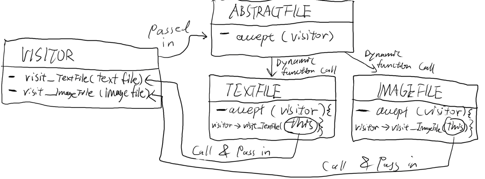

# Studio 19
1. Zix Chen, Shaza Ali
2.
    AbstractFile * file1 = new TextFile("textfile1");
    
    string str = "this is some content for text file 1";
    vector<char> writeContent(str.begin(), str.end());
    
    file1->write(writeContent);

    AbstractFile * file2 = new ImageFile("ImageFile1");
    file2->write({' ', 'X', ' ', 'X', ' ', ' ', ' ', ' ', ' ', '3'});

    vector<char> localContents1 = file1 -> read();

    // Define the string to add
    std::string extraContent = " and this is some extra content";
    // Append the string to the vector
    localContents1.insert(localContents1.end(), extraContent.begin(), extraContent.end());

    file1->write(localContents1);

    vector<char> localContents2 = file2 -> read();
    localContents2.pop_back();
    for (int i = 0; i < 4*4-localContents2.size()-1; i++)
    {
        localContents2.push_back('X');
    }
    localContents2.push_back('4');
    file2->write(localContents2);
    

conclusion: created dynamically bound text file and image file, read them and stored the contents in a local vector. 
modified the vectors and wrote them to the files. no error was thrown, however image file is unable to be displayed from 
main.

3. in the main function the visitor should be passed in to the accept function call of a file of the static type 
AbstractFile and then the file should dynamically call the accept function depending on its dynamic type, passing in the
 pointer to the AbstractFileVisitor. Then the dynamic object would make the visitor call the appropriate visit function
, passing in "this" as the parameter.

4.  Main File Tests
file1 contents using BasicDisplayVisitor:
this is some content for text file 1 and this is some extra content
file2 contents using BasicDisplayVisitor:
  X   X

X X X X
X X X X

Process finished with exit code 0

Delegation helps prevent modifying the existing interface by handling any new functionality in a visitor class which does 
the requested operations on different types of objects. For example, in our AbstractFile class, the accept method is what 
helps the visitor pattern that's defined in the AbstractFileVisitor class and then concretely implemented in the AbstractFileVisitor 
interface. The accept method is called on an AbstractFile object like file1/file2 and delegates corresponding operations to the 
corresponding visitor method for TextFile and ImageFile via file1->accept(&visitor) and file2-> accept(&visitor). 
This basically just helps prevent adding new operations to the base class and interface.

5. A new file type class would need to be created, the AbstractFileVisitor would need to be adjusted to support that new file type, 
and the concrete visitors would need to be able to handle the new file type. The limitation/negative consequence is that you have to modify the visitor
interface and all the concrete visitors every single time you want to add a new file type which causes a headache when maintaining 
the code for this mockos.

6. All unit tests pass!

